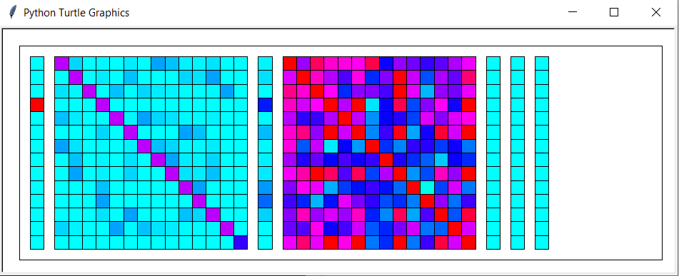

# dev_CMR_py
Development repo for Context Maintenance and Retrieval Model implementation updated for python

## CMR
Contains learning and recall functions as described in CMR

```
# CMR Model exposes the following interface
class CMR_Model(object):
	...
	# Present a feature for learning
	# recall boolean value toggles recall feedback phase (if true)
	def present_feature(self, f_i, recall=False):

	# Start recall of learned sequence
	# recall phase ends when timeout is reached or all features are recalled
	def recall(self, timeout=90000):

	# Saves the model state to binary
	def dump(self):

	# Loads a model state from file binary
	def load(self, b_file):
```

## Visualization
Simple python visualizer for learning parameters built on py turtle default engine

Maps value of feature/context items within [0-1] range onto HSV color-code by changing Hue [Light Blue - Red].



Matrices in sample (from left to right):

- f_i (feature presented)
- M_FC (feature to context) matrix of weights
- C_i (currently activated context)
- M_CF (context to feature) matrix of weights
- f_IN (feature input into accumulator)
- accum (accumulator values)
- f_out (recalled feature item)

## Issues
- Leaky Competitive Accumulator model of feature activation is yet to be fully implemented.